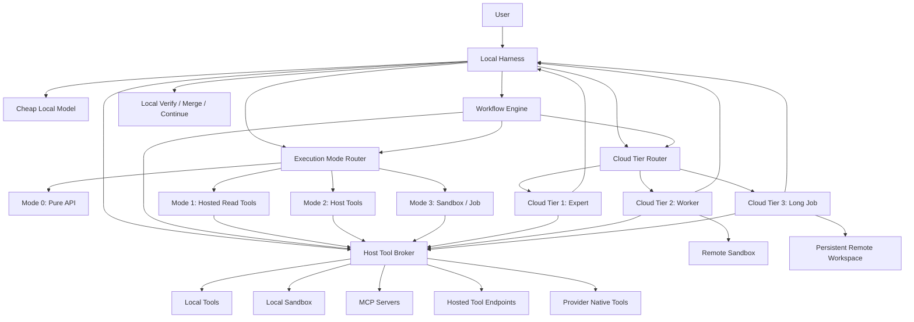
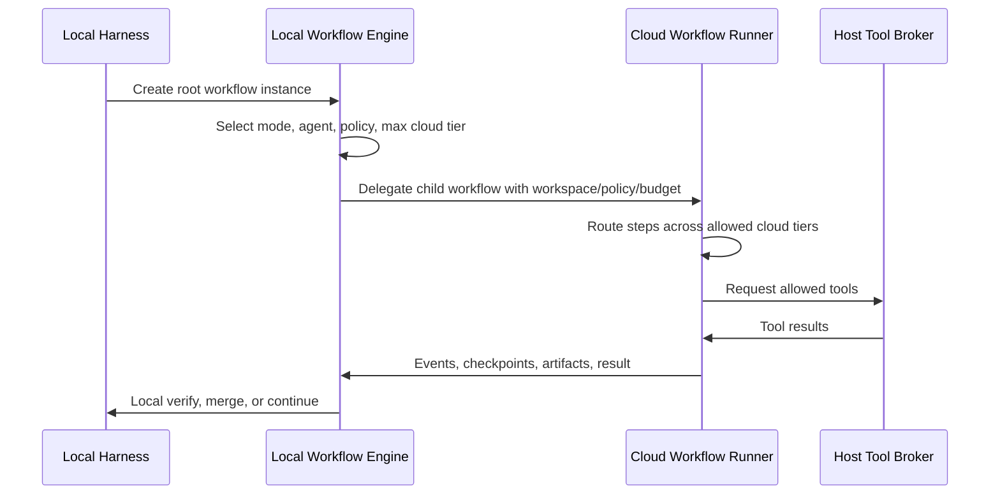
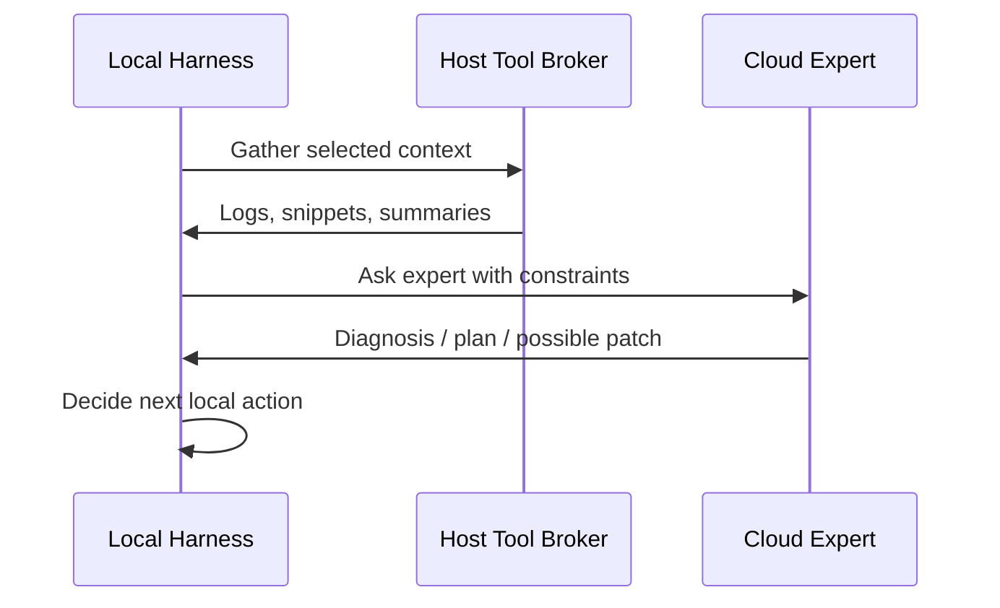
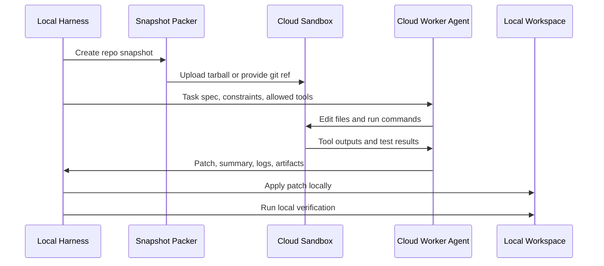
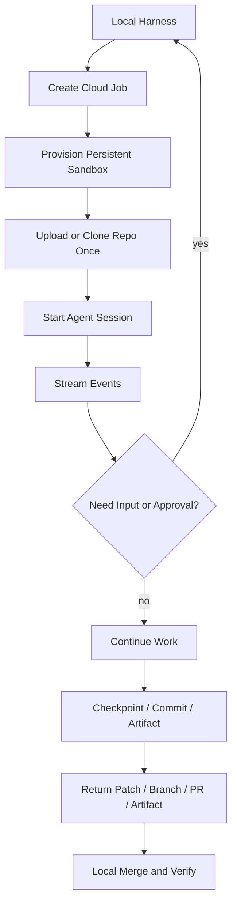
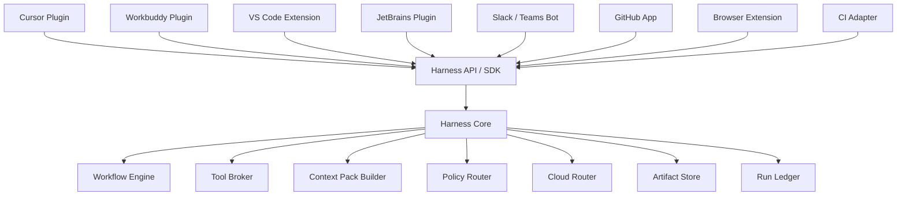

# Local-First Agent Harness Architecture

Date: 2026-06-19

Status: Draft design — under reconciliation review (see Part 0, added 2026-06-22).

> **Review note (2026-06-22):** This document was reviewed against the actual
> alpha-code / opencode codebase and the project's North Star (upgrade-isolation
> health = 0 conflict files) and ADRs (esp. ADR-002 / 005 / 010 / 011 and
> NON_GOALS). The original design (Sections 1–25) is preserved unchanged below.
> **Part 0 immediately following is the reconciliation layer** — it records what
> must change before this plan is built. Where a later section conflicts with
> Part 0, **Part 0 wins.** Read Part 0 first.

## Part 0. Architecture Review & Reconciliation (2026-06-22)

### 0.1 Verdict

This is a strong, internally consistent design — but it is written as if we are
building Claude Code from zero ("The local harness is the operating system,"
§25). alpha-code's thesis is the opposite: **do not rebuild the harness; layer
thin additions onto opencode and inherit every upstream upgrade** (ADR-005,
NON_GOAL #2/#3).

A source scan (2026-06-22) confirmed that **opencode already provides ~80% of the
"Local Harness" described here.** So the work is *not* "build this blueprint" — it
is "wire alpha seams onto existing opencode primitives, and build the three layers
this document omits: the cloud control plane, identity/billing, and
web/distribution."

### 0.2 Substrate principle — opencode IS the harness (do not rebuild)

The single biggest correction: Sections 2, 6, 7, 15, 17, 18 describe building a
harness, tool broker, permission system, provider router, session store, and
audit log. These are `@opencode-ai/core`'s job. Rebuilding them = the maintenance
hell ADR-005 and NON_GOAL #2 forbid. Confirmed mapping:

| This document proposes | opencode status | Key files | Correct action |
|---|---|---|---|
| §2.1 Local Harness main controller (planning/routing/auth/state/verify/audit) | ✅ already core | `core/src/session.ts`, `core/src/session/runner/` | **Do not build.** This is opencode |
| §7 Host Tool Broker (register/permission/approve/audit) | ✅ already exists | `plugin/src/tool.ts`, `core/src/permission.ts` + hooks `tool.execute.before/after`, `tool.definition`, `permission.ask` | **Do not build.** Layer policy via hooks |
| §6 Agent types (subagent / mode / permissions) | ✅ already exists | `core/src/agent.ts` (`mode: subagent/primary/all` + permission ruleset), `.opencode/agent/*.md` | **Reuse.** Do not invent a parallel `AgentSpec` registry |
| §15 Provider mapping / multi-provider routing | ✅ already exists | `llm/src/provider.ts`, `core/src/provider.ts` + hooks `chat.params`, `chat.headers` | **Do not build.** NON_GOAL: no second LLM orchestration layer |
| §18 Canonical API / SDK | ✅ OpenAPI auto-generated | `sdk/js/src/client.ts`, `server/src/api.ts` + SSE `/api/event` + PTY WS | **Do not start a new `/v1/*`.** Missing routes go in the sidecar (ADR-002) |
| §12 Skills / commands / MCP | ✅ full convention | `core/src/skill.ts`, `core/src/command.ts`, `core/src/config/mcp.ts`, `.opencode/{skill,command,agent}` | **Reuse.** Do not define a new skill format |
| §11 Jobs (local) | ⚠️ local version exists | `core/src/background-job.ts` (in-memory, no durability) | Fine locally; cloud durability is the new build |

Rule going forward: before adding any `type XxxSpec = {...}`, check whether
opencode already has an equivalent — it usually does.

### 0.3 Terminology fix — retire the overloaded "Cloud Tier"

This document's two scales (`Execution Mode 0–3` in §4 and `Cloud Tier 1–3` in
§5) collide with the ADRs and with each other:

- ADR-011 **already defines "Tier-1/2/3"** to mean *execution-environment weight*
  (in-process / ephemeral Box / persistent Box). This document's "Cloud Tier"
  reuses the same word for a different thing (autonomy/lifecycle). Same name,
  different meaning → guaranteed confusion.
- §2.2 claims Mode / Cloud Tier / Agent Type are orthogonal, but `Mode 3 = needs
  sandbox` and `Cloud Tier 2/3 = uses sandbox` are the same thing — not
  orthogonal. And "Cloud Tier" itself secretly bundles *autonomy* (advice vs
  worker) with *environment weight* (no sandbox vs persistent) — the two axes
  ADR-010/011 deliberately separated.

**Adopt the ADR's cleaner model — three axes, and delete the word "tier":**

| Axis | Values | Replaces |
|---|---|---|
| **Autonomy** (who decides the steps; ADR-010 litmus "can you write the steps now?") | `function` / `pipeline` / `bounded-agent` | the autonomy half hidden inside "Cloud Tier" |
| **Runtime weight** (what machinery) | `none` → `read-tools` → `brokered-tools` → `ephemeral-sandbox` → `persistent-sandbox` | this doc's `Mode 0–3` **+** ADR-011's `Tier-1/2/3`, merged into one axis |
| **Location** (deployment) | `local` / `cloud` | "cloud tier" as a standalone scale — location is a property, not a tier |

The doc's `Cloud Tier 1/2/3` then becomes *derived*, not foundational:
`Tier1 ≈ cloud + read-tools`, `Tier2 ≈ cloud + ephemeral-sandbox + bounded-agent`,
`Tier3 ≈ cloud + persistent-sandbox`. Agent role (research/code/review) stays as a
fourth, orthogonal specialization axis.

### 0.4 What is genuinely new — keep and invest here

These have no opencode equivalent and match ADR-010/011 closely. They are the
actual product, and the real work:

1. **Context Pack (§17.1)** — the explicit, auditable, previewable bundle sent to
   cloud, with redaction / exclusion / token estimate / privacy level. This is the
   "local-first privacy boundary" made concrete and the superset of ADR-010's task
   contract. **Top new-build item.**
2. **Run Ledger (§17.3) + Provenance (§17.5) + Verification Gates (§17.4)** —
   opencode does not verify results. "Verification is the moat" is correct; this is
   what you sell over a bare agent.
3. **Capability tokens (§17.2)** — short-TTL, min-scope, job/tool-bound — matches
   ADR-011's broker design exactly.
4. **Local owns final apply/merge/verify; cloud returns only proposals
   (§2.1/§17.6)** — matches ADR-010 "agency local, determinism cloud."
5. **Cloud control plane = MCP gateway + dispatch ingress + Upstash orchestration**
   — the only genuinely new infrastructure (confirmed: `cloud.dispatch` contract,
   Upstash Workflow/QStash binding, tier router, Box integration, durable ledger
   are all unbuilt). This is the 6-month main effort, not anything opencode gives.

### 0.5 The missing layers — "web + backend" is THREE backends, not one

The product surface (desktop app + website/download + backend) maps to three
distinct backends. The document blurs them into one undifferentiated "backend."

| Backend | Runs where | Owns | Status / ADR |
|---|---|---|---|
| **A. Local sidecar** | inside ui-mac, Electron `utilityProcess` | local HTTP the desktop UI needs that opencode server lacks; websearch direct; alpha-secrets | ✅ exists (`ui-mac/src/main/server.ts`, `alpha-secrets.ts`), ADR-002/009 |
| **B. Cloud control plane + MCP tool gateway** | AWS ECS/Fargate | `cloud.dispatch` server-side validation, Upstash Workflow/QStash orchestration, tier router, **central MCP tool gateway (secrets + capability tokens)**, Box sandboxes, run ledger (Redis), **multi-tenant authn/quota/billing** | ❌ new, ADR-010/011 |
| **C. Distribution / website backend** | Vercel/Netlify + object store | marketing site (static), downloads, **electron auto-update feed**, license/activation, signup/login, billing portal | ❌ new, **not covered anywhere in this doc** |

Two corrections this implies:

- **§18.1 is wrong to define a fresh `127.0.0.1:8765/v1/*`** exposing
  sessions/tools/events. opencode's server already exposes those via the SDK. The
  sidecar should add only what opencode lacks: context-pack preview,
  `cloud.dispatch` ingress, run-ledger views. Everything else goes through
  `@opencode-ai/sdk` (CLAUDE.md hard constraint ②).
- **Identity is the missing foundation that spans A/B/C.** The doc has per-job /
  per-tool capability tokens but **no user/tenant identity layer**. "Pay-per-task
  outcomes" requires it: C issues identity, B verifies it for quota/billing/
  isolation. ADR-010 §7 lists these as unresolved (tenant isolation, authn/authz,
  quota/billing, **LLM key ownership: platform-pays vs BYOK**, abuse prevention).
  **LLM-key ownership must be decided first** — locally opencode uses the user's
  own keys, but who pays for the cloud Anthropic calls changes the entire billing
  architecture and the ledger schema.
- **Auto-update (C)** is the one non-trivial piece: electron-builder's updater
  needs a static feed (`latest-mac.yml`); this hangs directly off ADR-012's prod
  channel and `UPDATER_ENABLED`. Don't underestimate Mac signing/notarization.

### 0.6 Multi-tenant security correction

§10.7/§21 assume the local harness owns the root workflow and the cloud is a
constrained child that "emits an approval if it wants to exceed bounds." **That
holds for a single trusted user; it breaks for untrusted multi-tenant.** The cloud
gateway **cannot trust** the policy (budget/tier/network) the local harness claims
— the local machine is user-controlled and tamperable. ADR-010 §6/§3 already has
the right model: **`cloud.dispatch` is hard-validated server-side (skill is soft
guidance, the schema is the hard gate), and egress control is orthogonal to and
independent of admission audit.** Rewrite §10.7/§21 so the cloud is an
**independent trust domain**: policy from the local side is a *request*; the cloud
gateway *re-enforces* per-tenant quota/scope. Also add the known **Box egress
limitation** (ADR-011 security section) — the doc never mentions it, and it's why
the Tier-3 sandbox choice is deliberately *not* locked.

### 0.7 Conflicts with NON_GOALS / scope to cut

- **§19 Embeddability (Cursor/VS Code/JetBrains/Slack/Teams/GitHub/browser/CI)**
  ⟂ **NON_GOAL #6 (Mac desktop only; do not revive web/tui/console/enterprise
  forms).** Massive scope expansion that fights "thin customization, single
  maintainer." → Move the whole section to "Future / Out of Current Scope," or
  drop it. `[DRIFT]`
- **§12.3 Pack ecosystem + marketplace + third-party packs** — far future. MVP
  caps at 2–3 official packs (the doc says so itself); §23 Phase 4 schedules
  plugin format / pack registry / eval too early.
- **Ensemble tools + `web.search.ensemble` + multi-provider routing** — over-
  engineered. opencode already abstracts providers; ADR-009 already opens
  websearch. One logical `web.search` is enough for MVP; do not build six
  implementations plus an ensemble first.

### 0.8 Reranked MVP — aligned with G4 (supersedes §23 phases)

§23 Phase 1 = "build harness + broker + workflow engine + context pack + ledger +
policy + token + sandbox + model adapter." **~80% of that already exists.**
Rerank around G4 (one real non-coding task, end to end):

| Milestone | Content | New build |
|---|---|---|
| **M0** ✅ done | ext plugin + sidecar + alpha-secrets + websearch default on | exists |
| **M1 — Context Pack** | local builder + preview; one `.opencode/skill` produces a schema-constrained task contract (ADR-010) | small, local, zero upstream change |
| **M2 — Dispatch ingress** | MCP `cloud.dispatch(contract)` + sidecar Zod validation → returns `job_id` | small |
| **M3 — Minimal cloud plane** | **Tier-1 (in-process) only**: ECS endpoint + thin Upstash Workflow wrapper + direct Anthropic call; run ledger in Redis; **one real task (deep research)** | large but focused |
| **M4 — Return path** | `cloud.await/status` via poll first; result lands as a local artifact | small |

Resolve §0.9 (identity/billing/key ownership) **before M3**, or the ledger schema
gets reworked. Tier-2/3 sandboxes, pack ecosystem, embeddability, eval system, and
the full verification-gate suite are all **post-MVP**.

### 0.9 Open decisions to resolve before the cloud build (ADR-010 §7)

These are blocking and should be decided first (a one-page decision memo, then a
new ADR):

1. **LLM key ownership**: platform-pays vs BYOK vs hybrid. Drives billing + ledger.
2. **Tenant model**: per-user isolation only, or team/shared workspaces?
   (NON_GOALS leaves team collaboration "另议".)
3. **Identity system**: what issues/verifies user identity across A/B/C (the
   foundation under capability tokens).
4. **Billing unit**: per-task, per-token, subscription, or metered.
5. **Tier-3 sandbox**: stays deliberately open (Box egress limitation) — confirm
   v1 ships Tier-1/2 only.

### 0.10 Section-by-section disposition

How to treat each existing section when this draft is revised:

| Sections | Disposition |
|---|---|
| §1 Goal; §2.3/2.4 (shared/logical tools); §2.6 (workflow boundary); §8–§10, §13–§14, §16, §22 | **Keep** (workflow durability = Upstash per ADR-011) |
| §2.1 (main controller); §6 (agent types); §7 (tool broker); §15 (providers); §17 broker/policy parts; §18 (API); §24 (interfaces) | **Remap** onto existing opencode primitives (see 0.2); stop describing them as new |
| §2.2 (orthogonal dims); §4 (Modes); §5 (Cloud Tiers) | **Supersede** with the three-axis model (0.3); delete "tier" as a standalone scale |
| §17.1 Context Pack; §17.2 tokens; §17.3 ledger; §17.4 gates; §17.5 provenance | **Keep + prioritize** — the genuinely new value (0.4) |
| §0.5 backends; identity layer; web/distribution (C) | **Add** — missing from the original (0.5) |
| §10.7, §20, §21 | **Augment** with multi-tenant re-validation + Box egress (0.6) |
| §19 Embeddability; §12.3 marketplace; ensemble tools | **Defer / cut** — conflicts with NON_GOALS (0.7) `[DRIFT]` |
| §23 MVP phases | **Supersede** with the M0–M4 rerank (0.8) |
| §25 "local harness is the OS" | **Reword**: opencode is the harness; alpha is the control-plane skin + the cloud plane |

---

## 1. Goal

Build a general-purpose, local-first agent harness similar in spirit to Claude Code:

- Use cheap local models for routine work.
- Escalate hard problems to cloud expert agents.
- Let cloud agents run isolated tasks when useful.
- Let cloud agents handle long-running jobs when local execution is inefficient.
- Keep the local harness in control of tools, permissions, audit, merging, and final verification.
- Support multiple providers, including OpenAI, Claude, local models, self-hosted tools, MCP servers, and custom skills.

The system should not be tightly coupled to any single model vendor. Providers are implementation backends. The stable product boundary is the local harness, tool broker, job protocol, and agent contracts.

## 2. Core Decisions

### 2.1 Local Harness Is the Main Controller

The local harness owns:

- Task planning and routing.
- Tool authorization.
- Local workspace state.
- Patch application.
- Final verification.
- Audit logs.
- Budget and latency policy.
- Escalation decisions.

Cloud agents can advise, execute in isolated sandboxes, or run long jobs, but they should not directly mutate the user's real local workspace.

### 2.2 Execution Mode, Cloud Tier, and Agent Type Are Orthogonal

> **[Superseded by Part 0.3]** These are not truly orthogonal, and "Cloud Tier"
> collides with ADR-011's `Tier-1/2/3`. Use the three-axis model in §0.3.

Use three independent dimensions:

- Execution mode: how much machinery the request needs, from pure API to sandbox/job.
- Cloud tier: cloud escalation depth, autonomy, lifecycle, and permissions.
- Agent type: specialization, tool set, input/output contract, and quality bar.

For example:

- A simple explanation can use Mode 0 with no cloud tier.
- A current-events lookup can use Mode 1 with hosted read tools.
- A Research Agent can run in Mode 1 as a Tier 1 expert, or in Mode 3 as a Tier 3 long research job.
- A Code Agent can run in Mode 2 for patch generation, Mode 3 for test execution, Tier 2 for one isolated cloud patch, or Tier 3 for a multi-hour migration.

### 2.3 Host Tools Are Shared Infrastructure

Host tools are not only for cloud agents. They are shared by:

- Local harness.
- Local model.
- Cloud Tier 1 expert.
- Cloud Tier 2 worker.
- Cloud Tier 3 long-running agent.
- UI, CLI, SDK, and automation jobs.

Different callers receive different permissions through the Host Tool Broker.

### 2.4 Expose Logical Tools, Hide Provider Implementations

Agents should see logical tools such as:

- `web.search`
- `web.fetch`
- `repo.read_file`
- `repo.search`
- `sandbox.exec`
- `artifact.upload`
- `job.start`

The broker can route a logical tool to one of many implementations:

- OpenAI hosted tool.
- Claude hosted tool.
- Self-hosted service.
- Remote MCP server.
- Local implementation.
- Ensemble implementation.

Do not expose three competing `websearch` tools directly to normal agents. Expose one logical `web.search`; route behind the scenes.

### 2.5 API Is the Core Contract

Use:

- API as the canonical protocol.
- SDK for developer ergonomics.
- CLI for human use, CI, scripts, and debugging.
- MCP as an interoperability adapter for tools.

The CLI should not be the only internal protocol. The local harness and remote jobs should communicate using structured APIs and schemas.

### 2.6 Workflows Are the Product Boundary

A workflow is a reusable task state machine. It turns a user goal into ordered steps, each with its own execution mode, agent type, tools, cloud tier, approval policy, success criteria, and artifact policy.

Workflows are where the product creates durable value beyond raw model calls:

- They make tasks repeatable.
- They provide checkpoints, retries, and resumability.
- They decide when to stay local and when to escalate.
- They define verification and acceptance criteria.
- They collect artifacts and audit records.
- They can run locally, partly in the cloud, or fully as a cloud job.

The local harness should create and own the root workflow instance. Cloud workers may execute delegated workflow steps or run a child workflow, but they remain constrained by the workflow policy passed by the local harness.

## 3. High-Level Architecture



## 4. Execution Mode Model

Execution mode answers: what does this request need to touch?

It is decided before, or alongside, cloud escalation. Many requests never need a cloud tier at all.

| Mode | Name | Needs Tool? | Needs Sandbox? | Typical Use |
|---|---|---:|---:|---|
| Mode 0 | Pure API | No | No | Explanation, translation, summarization, small code snippets |
| Mode 1 | API + Hosted Read Tools | Yes, read-only | No local sandbox | Web search, web fetch, retrieval, file search, citations |
| Mode 2 | API + Host Tools | Yes | Usually no sandbox | Repo search, read files, draft patch, inspect logs, route tools through broker |
| Mode 3 | Sandbox / Job | Yes | Yes | Run code, edit files, build, test, generate artifacts, long-running work |

### 4.1 Mode 0: Pure API

Purpose:

- Answer simple requests with a model call only.

Execution boundary:

- No tools.
- No filesystem access.
- No sandbox.
- No remote workspace.

Typical tasks:

- Explain a concept.
- Translate or rewrite text.
- Summarize provided content.
- Generate a small code snippet.
- Provide a high-level design opinion from supplied context.

### 4.2 Mode 1: API + Hosted Read Tools

Purpose:

- Let the model use hosted read-only capabilities without touching the local environment.

Execution boundary:

- Uses tools such as `web.search`, `web.fetch`, retrieval, or file search.
- No local command execution.
- No local file mutation.
- No sandbox unless the provider's hosted read tool internally uses one.

Typical tasks:

- Search current documentation.
- Fetch and summarize a URL.
- Query a vector store.
- Compare public sources.
- Answer with citations.

### 4.3 Mode 2: API + Host Tools

Purpose:

- Let the model or harness use brokered host tools while keeping execution controlled.

Execution boundary:

- Tools are called through the Host Tool Broker.
- Can read repo files, search logs, inspect artifacts, or draft patches.
- Write actions are usually represented as proposed patches, not directly applied.
- No arbitrary command execution unless routed to a controlled executor.

Typical tasks:

- Search a codebase.
- Read selected files.
- Produce a patch proposal.
- Inspect existing logs.
- Ask an expert with repo context.
- Use custom business tools through MCP or HTTP.

### 4.4 Mode 3: Sandbox / Job

Purpose:

- Run real commands, mutate files in an isolated workspace, generate artifacts, or perform long-running work.

Execution boundary:

- Uses local sandbox, remote sandbox, or job runner.
- Can execute commands under policy.
- Can write files in an isolated workspace.
- Can return patches, logs, artifacts, and checkpoints.
- Final application to the real local workspace remains controlled by the local harness.

Typical tasks:

- Run tests or builds.
- Execute scripts.
- Modify code and validate it.
- Generate Word, Excel, PowerPoint, PDF, images, or reports.
- Run a long migration job.

### 4.5 Mode and Cloud Tier Mapping

Mode is not the same as cloud tier.

| Execution Mode | Common Cloud Tier |
|---|---|
| Mode 0 | None, or Cloud Tier 1 for stronger reasoning |
| Mode 1 | None, or Cloud Tier 1/Tier 3 for research |
| Mode 2 | None, Cloud Tier 1 for advice, Cloud Tier 2 for isolated patch work |
| Mode 3 | Local sandbox, Cloud Tier 2 worker, or Cloud Tier 3 long job |

## 5. Cloud Tier Model

> **[Superseded by Part 0.3]** Retire the term "Cloud Tier" — it overloads
> autonomy with environment weight and collides with ADR-011. Tier 1/2/3 here
> become derived from the `location` + `runtime weight` axes.

Cloud tier answers: if this task should leave the local loop, how autonomous should the remote side be?

### 5.1 Tier 1: Cloud Expert

Purpose:

- Ask a stronger model for diagnosis, design advice, review, or planning.

Execution boundary:

- No direct write access.
- Usually no sandbox required.
- Receives selected context, logs, snippets, summaries, and constraints.
- Returns structured advice, diagnosis, patch suggestion, or plan.

Typical tasks:

- Explain a complex error.
- Compare architecture options.
- Review a proposed patch.
- Identify likely root cause.
- Produce a migration plan.
- Research current external documentation.

Recommended output contract:

```json
{
  "diagnosis": "string",
  "recommended_next_steps": ["string"],
  "possible_patch": "optional unified diff or explanation",
  "tests_to_run": ["string"],
  "risk": "low|medium|high",
  "confidence": 0.82
}
```

### 5.2 Tier 2: Cloud Independent Worker

Purpose:

- Let a cloud agent independently handle a scoped task in an isolated sandbox.

Execution boundary:

- Receives a repo snapshot, git branch, or mounted workspace copy.
- Can read/write inside the isolated sandbox.
- Can run allowed commands.
- Cannot directly modify the real local workspace.
- Returns patch, artifacts, logs, and summary.

Typical tasks:

- Fix one bug.
- Implement one module.
- Run tests in a clean environment.
- Generate a document or artifact.
- Try an approach without polluting local state.

Recommended output contract:

```json
{
  "base_commit": "abc123",
  "summary": "string",
  "patch": "unified diff",
  "files_changed": ["path/to/file"],
  "tests_run": ["npm test -- auth"],
  "artifacts": ["artifact_id"],
  "open_questions": ["string"],
  "confidence": 0.81
}
```

The local harness then applies the patch locally and reruns verification.

### 5.3 Tier 3: Cloud Long-Running Agent

Purpose:

- Run long tasks with persistence, streaming events, checkpoints, and resumability.

Execution boundary:

- Uses a persistent remote workspace or managed agent session.
- Can run for minutes or hours.
- Streams progress events.
- Can checkpoint, pause, resume, request approval, and return artifacts.
- Final merge still happens through the local harness.

Typical tasks:

- Large framework migration.
- Long research project.
- Multi-stage refactor.
- Batch document generation.
- Big test stabilization effort.
- Deep dependency or security analysis.

Recommended job contract:

```json
{
  "job_id": "cloudjob_123",
  "status": "queued|running|blocked|completed|failed|cancelled",
  "remote_workspace_id": "rws_456",
  "base_commit": "abc123",
  "latest_checkpoint": "string",
  "events_url": "/v1/jobs/cloudjob_123/events",
  "result_url": "/v1/jobs/cloudjob_123/result",
  "requires_action": null
}
```

## 6. Agent Types

Agent type defines specialization, tools, and output format. Execution mode defines the required runtime machinery. Cloud tier defines remote autonomy and lifecycle.

### 6.1 Recommended MVP Agent Types

| Agent | Primary Role | Common Cloud Tiers | Default Permissions |
|---|---|---|---|
| `research-agent` | Search, summarize, compare sources, cite evidence | Tier 1, Tier 3 | Read/network |
| `architect-agent` | Design, decompose tasks, evaluate tradeoffs | Tier 1 | Read-only |
| `code-agent` | Implement scoped code changes and return patches | Tier 2, Tier 3 | Sandbox write |
| `review-agent` | Find bugs, regressions, security risks, missing tests | Tier 1, Tier 2 | Usually read-only |
| `docs-office-agent` | Create/edit docs, spreadsheets, presentations, PDFs | Tier 2, Tier 3 | Artifact write |

### 6.2 Additional Agent Types Later

| Agent | Primary Role |
|---|---|
| `debug-agent` | Reproduce failures, inspect logs, isolate root cause |
| `test-agent` | Add tests, run test matrices, improve coverage |
| `security-agent` | Dependency audit, secret scanning, risky permission analysis |
| `data-agent` | CSV, Excel, notebooks, charts, statistical analysis |
| `release-agent` | Changelog, release notes, versioning, deployment checklist |

### 6.3 Agent Spec

```ts
type AgentSpec = {
  name: string
  role: string
  allowedTools: string[]
  defaultMode: "mode0" | "mode1" | "mode2" | "mode3"
  defaultCloudTier?: "tier1" | "tier2" | "tier3"
  maxBudgetUsd: number
  maxRuntimeSec: number
  inputContract: JSONSchema
  outputContract: JSONSchema
  canWrite: boolean
  requiresSandbox: boolean
}
```

Example:

```ts
const codeAgent: AgentSpec = {
  name: "code-agent",
  role: "Implement scoped code changes and return a verified patch.",
  allowedTools: [
    "repo.read_file",
    "repo.search",
    "sandbox.exec",
    "patch.create",
    "artifact.upload"
  ],
  defaultMode: "mode3",
  defaultCloudTier: "tier2",
  maxBudgetUsd: 2,
  maxRuntimeSec: 1800,
  inputContract: codeTaskInputSchema,
  outputContract: patchResultSchema,
  canWrite: true,
  requiresSandbox: true
}
```

## 7. Host Tool Broker

The Host Tool Broker is the capability layer for the whole system.

Responsibilities:

- Register tools.
- Route logical tools to concrete implementations.
- Enforce permissions.
- Apply risk policy.
- Handle approvals.
- Track budget and usage.
- Normalize outputs.
- Write audit logs.
- Hide secrets from models.
- Keep provider-specific details out of agent prompts.

### 7.1 Tool Spec

```ts
type ToolSpec = {
  name: string
  description: string
  inputSchema: JSONSchema
  outputSchema: JSONSchema
  risk: "read" | "write" | "network" | "destructive" | "credentialed"
  execution: "local" | "cloud" | "hybrid"
  transport: "local" | "http" | "mcp" | "provider_native" | "job"
  provider?: "local" | "openai" | "claude" | "mcp" | "custom"
  endpoint?: string
  skill?: string
  requiresApproval?: boolean
}
```

### 7.2 Tool Invocation Envelope

All tool calls should carry caller identity, policy, and task context.

```json
{
  "caller": {
    "type": "local_harness|local_model|cloud_agent|job_worker",
    "tier": "tier1|tier2|tier3",
    "agent": "code-agent",
    "task_id": "task_123"
  },
  "tool": "sandbox.exec",
  "input": {
    "command": "npm test"
  },
  "policy": {
    "timeout_ms": 120000,
    "max_cost_usd": 0.25,
    "network": "disabled",
    "approval_required": false
  }
}
```

### 7.3 Permission Model

| Caller | Suggested Permissions |
|---|---|
| Local Harness | Highest permission, can apply patches and merge results |
| Local Model | Read repo, run low-risk commands, request patches |
| Tier 1 Expert | Mostly read-only, selected context only |
| Tier 2 Worker | Read/write inside isolated sandbox, return diff |
| Tier 3 Agent | Persistent sandbox with budget, checkpoint, and approval limits |

Example policy:

```ts
if (caller.tier === "tier1" && tool.risk !== "read" && tool.risk !== "network") {
  deny()
}

if (tool.risk === "destructive" || tool.risk === "credentialed") {
  requireHumanApproval()
}

if (caller.type === "local_harness") {
  allowWithAudit()
}
```

## 8. Tool Routing

Expose one logical capability to agents; route to implementations internally.

### 8.1 Example: `web.search`

Logical tool:

```ts
web.search(query, options)
```

Possible implementations:

- `web.search.self`
- `web.search.openai`
- `web.search.claude`
- `web.search.brave`
- `web.search.tavily`
- `web.search.ensemble`

Routing policy:

```ts
if (task.requiresCompliance) use("web.search.self")
else if (task.requiresCrossCheck) use("web.search.ensemble")
else if (caller.provider === "openai" && nativeToolsAllowed) use("web.search.openai")
else if (caller.provider === "claude" && nativeToolsAllowed) use("web.search.claude")
else use(defaultSearchProvider)
```

### 8.2 Search vs Fetch

Keep search and fetch separate:

- `web.search`: discover candidate sources.
- `web.fetch`: read a known URL.
- `web.extract`: extract structured content from a page/document.

Do not use search when the URL is already known.

## 9. Hosted Tool Implementations

A hosted tool can be registered locally while implemented remotely.

The local registry stores:

- Name.
- Description.
- Input/output schemas.
- Risk level.
- Transport.
- Endpoint or provider adapter.
- Auth policy.
- Timeout and budget policy.

The implementation may live behind:

- HTTP endpoint.
- MCP server.
- Provider-native hosted tool.
- Async job API.
- Queue worker.

### 9.1 HTTP Tool Example

```http
POST https://tools.example.com/v1/tools/web.search/invoke
Authorization: Bearer <capability_token>
Content-Type: application/json
```

```json
{
  "caller": {
    "type": "local_harness",
    "task_id": "task_123"
  },
  "input": {
    "query": "OpenAI hosted shell docs",
    "domains": ["developers.openai.com"],
    "freshness": "latest"
  },
  "policy": {
    "max_cost_usd": 0.05,
    "timeout_ms": 15000
  }
}
```

Response:

```json
{
  "ok": true,
  "result": {
    "items": [
      {
        "title": "string",
        "url": "https://example.com",
        "snippet": "string"
      }
    ]
  },
  "usage": {
    "cost_usd": 0.003,
    "latency_ms": 820
  }
}
```

### 9.2 Provider-Native Tool Example

For OpenAI or Claude native hosted tools, the broker calls the provider API and enables the relevant tool in that request.

The agent still sees:

```ts
web.search()
```

The broker may route to:

```ts
web.search.openai()
web.search.claude()
web.search.self()
```

Provider-specific tool names and request structures stay inside adapters.

## 10. Workflow Model

Workflow answers: how should this user goal be completed from start to finish?

It is the orchestration layer above execution modes, cloud tiers, agents, tools, skills, and jobs.

### 10.1 Workflow vs Mode vs Cloud Tier

| Concept | Question It Answers | Example |
|---|---|---|
| Workflow | What sequence of steps completes this goal? | Bug fix, code review, research report |
| Execution Mode | What machinery does this step need? | Pure API, read tools, host tools, sandbox/job |
| Cloud Tier | If remote help is needed, how autonomous is it? | Expert, worker, long-running agent |
| Agent Type | Who should do this step? | Research agent, code agent, review agent |
| Tool | What atomic capability is called? | `web.search`, `repo.read_file`, `sandbox.exec` |
| Skill | What reusable expertise guides the work? | `bugfix`, `pptx`, `migration` |
| Job | How is long async execution represented? | `job_123` with events/checkpoints/results |

### 10.2 Workflow Spec

A workflow spec is reusable. It describes a task pattern, not one specific run.

```ts
type WorkflowSpec = {
  id: string
  name: string
  description: string
  triggers: string[]
  inputs: JSONSchema
  steps: WorkflowStepSpec[]
  defaultMode: "mode0" | "mode1" | "mode2" | "mode3"
  escalationPolicy: EscalationPolicy
  approvalPolicy: ApprovalPolicy
  artifactPolicy: ArtifactPolicy
  successCriteria: string[]
  failurePolicy: FailurePolicy
}
```

### 10.3 Static Template and Dynamic Runtime

Workflows should use a hybrid model:

```text
Workflow Template = static boundary and required phases
Workflow Plan = dynamic step plan generated for the current task
Workflow Run = dynamic execution with retries, branches, escalation, and checkpoints
```

Do not build workflows as fully static scripts. Real tasks branch:

- The local model may solve the task without cloud escalation.
- Tests may fail and require a repair loop.
- The project may not have a runnable test suite.
- The task may involve private files that cannot be uploaded.
- The task may exceed budget and need to pause.
- The task may need a provider-native skill or a different runner.

Do not build workflows as fully dynamic agent improvisation either. Fully dynamic workflows make cost, permissions, audit, UI progress, retries, and repeatability much harder to control.

The recommended model is a policy-bounded dynamic plan:

- Static workflow template defines phases, allowed agents, allowed tools, max cloud tier, approvals, budgets, artifact policy, and success criteria.
- Dynamic workflow plan chooses the concrete steps, tools, agents, modes, and cloud tiers for the current input.
- Dynamic workflow run executes the plan and may retry, branch, escalate, pause for approval, or create a cloud job.

Example:

```text
bugfix.workflow template
- Required phases: intake, diagnose, change, verify, report
- Allowed agents: code-agent, review-agent, test-agent
- Allowed modes: Mode 2, Mode 3
- Max cloud tier: Tier 2
- Required success criteria: patch applies; tests pass or failure is explained
- Approval required for: dependency install, large patch, network write
```

Runtime plan:

```text
1. collect-context        -> Mode 2, local
2. local-diagnosis        -> Mode 0, local model
3. repo-search            -> Mode 2, host tools
4. patch-draft            -> Mode 2, code-agent
5. run-tests              -> Mode 3, local sandbox
6. ask-expert-if-needed   -> Cloud Tier 1
7. delegate-if-needed     -> Cloud Tier 2
8. final-report           -> Mode 0/2
```

In short:

```text
Workflow Template is static.
Workflow Plan is dynamically generated.
Workflow Run is dynamically executed.
```

### 10.4 Workflow Step

Each workflow step chooses its own mode, agent, tools, skill, and optional cloud tier.

```ts
type WorkflowStepSpec = {
  id: string
  name: string
  agent?: string
  skill?: string
  mode: "mode0" | "mode1" | "mode2" | "mode3"
  cloudTier?: "tier1" | "tier2" | "tier3"
  tools: string[]
  inputsFrom: string[]
  outputs: string[]
  successCriteria: string[]
  retryPolicy?: RetryPolicy
  approvalRequired?: boolean
}
```

Example step:

```json
{
  "id": "run-tests",
  "name": "Run focused tests",
  "agent": "code-agent",
  "mode": "mode3",
  "cloudTier": "tier2",
  "tools": ["sandbox.exec", "artifact.upload"],
  "inputsFrom": ["patch-draft"],
  "outputs": ["test-log", "verification-summary"],
  "successCriteria": ["Relevant tests pass"]
}
```

### 10.5 Workflow Instance

A workflow instance is one concrete run created from a workflow spec.

```ts
type WorkflowInstance = {
  workflow_id: string
  run_id: string
  status: "created" | "running" | "blocked" | "completed" | "failed" | "cancelled"
  owner: "local_harness" | "cloud_runner"
  parent_run_id?: string
  current_step_id?: string
  mode?: "mode0" | "mode1" | "mode2" | "mode3"
  cloudTier?: "tier1" | "tier2" | "tier3"
  budget: BudgetPolicy
  policy: WorkflowPolicy
  artifacts: string[]
  audit_log_id: string
}
```

The local harness should own the root workflow instance. A cloud worker may receive a child workflow instance for delegated work.

### 10.6 Local Workflow Execution

Use local workflow execution when:

- The task is simple.
- The task needs local repo/files but not heavy execution.
- Sensitive data should not leave the machine.
- Local tools and dependencies are available.
- The workflow can complete quickly.

Example:

```text
User: "Review this diff"
-> create workflow: code-review
-> Mode 2: read git diff and relevant files
-> optional Cloud Tier 1 expert if local review confidence is low
-> produce review artifact
```

### 10.7 Cloud Workflow Execution

A cloud task can be unified as a workflow running in the cloud.

The local harness creates the root workflow and may delegate a step or child workflow to the cloud:



The cloud runner may internally decide whether a step should use Tier 1, Tier 2, or Tier 3, but only within the bounds passed by the local harness:

- Maximum allowed cloud tier.
- Budget.
- Runtime limit.
- Tool permissions.
- Network policy.
- Workspace scope.
- Approval requirements.

If the cloud runner wants to exceed those bounds, it must emit an approval request instead of escalating silently.

### 10.8 Workflow as Job

A long-running cloud workflow should be represented as a job.

```json
{
  "job_id": "job_123",
  "workflow_run_id": "wf_run_456",
  "workflow_id": "migration.workflow",
  "status": "running",
  "cloud_tier": "tier3",
  "events_url": "/v1/jobs/job_123/events",
  "result_url": "/v1/jobs/job_123/result"
}
```

Short workflows can run synchronously. Long workflows should run through the job system.

### 10.9 Recommended Workflows

| Workflow | Primary Goal | Common Modes | Common Cloud Tiers |
|---|---|---|---|
| `bugfix.workflow` | From error to patch and tests | Mode 2, Mode 3 | Tier 1, Tier 2 |
| `code-review.workflow` | Review diff for correctness and risk | Mode 2 | Tier 1 |
| `migration.workflow` | Multi-step upgrade or refactor | Mode 3 | Tier 2, Tier 3 |
| `research.workflow` | Search, verify, synthesize, cite | Mode 1, Mode 3 | Tier 1, Tier 3 |
| `office-report.workflow` | Produce Word/PPT/Excel artifacts | Mode 3 | Tier 2, Tier 3 |
| `data-analysis.workflow` | Analyze CSV/Excel and generate charts/report | Mode 3 | Tier 2 |
| `docs.workflow` | Generate or update docs from code | Mode 2, Mode 3 | Tier 1, Tier 2 |

### 10.10 Example: Bug Fix Workflow

```text
bugfix.workflow
1. Collect error logs and current git state.
2. Use local model for initial diagnosis.
3. Search repo for relevant files.
4. Draft a patch.
5. If confidence is low, ask Cloud Tier 1 expert.
6. If execution is needed, run Mode 3 sandbox tests.
7. If local attempts fail, delegate to Cloud Tier 2 worker.
8. Apply returned patch locally.
9. Run local verification.
10. Save patch, logs, and summary as artifacts.
```

### 10.11 When the Local Harness Should Create a Workflow

Create a workflow when:

- The task has more than one step.
- The task needs tools, files, artifacts, or verification.
- The task may need escalation.
- The task should be resumable or auditable.
- The user asks for a named repeatable operation.
- The task has meaningful success criteria.

Do not create a workflow for trivial Mode 0 requests unless the user wants history, templates, or automation.

## 11. Jobs

Jobs are the runtime container for asynchronous, long-running, resumable workflow execution.

Use jobs for:

- Cloud Tier 3 agents.
- Long Cloud Tier 2 tasks.
- Batch processing.
- Remote artifact generation.
- Work that needs events, checkpoints, or cancellation.
- Any workflow instance that should not block the local harness synchronously.

### 11.1 Job API

Create job:

```http
POST /v1/jobs
```

```json
{
  "workflow_id": "migration.workflow",
  "workflow_run_id": "wf_run_456",
  "agent": "code-agent",
  "cloud_tier": "tier3",
  "objective": "Upgrade the project to the new framework version and fix tests.",
  "workspace": {
    "type": "git",
    "repo": "git@github.com:org/repo.git",
    "ref": "feature/migration"
  },
  "policy": {
    "max_runtime_sec": 14400,
    "max_cost_usd": 20,
    "network": "restricted",
    "requires_approval_for": ["dependency_install", "external_network", "deploy"]
  }
}
```

Response:

```json
{
  "job_id": "job_123",
  "workflow_run_id": "wf_run_456",
  "status": "running",
  "events_url": "/v1/jobs/job_123/events",
  "result_url": "/v1/jobs/job_123/result"
}
```

### 11.2 Job Events

Use SSE or WebSocket for streaming progress.

Example events:

```json
{ "type": "job.started", "job_id": "job_123", "workflow_run_id": "wf_run_456" }
{ "type": "workflow.step.started", "step_id": "run-tests" }
{ "type": "agent.message", "content": "I found 3 failing tests." }
{ "type": "tool.started", "tool": "sandbox.exec", "command": "npm test" }
{ "type": "tool.completed", "exit_code": 1, "summary": "2 tests failed" }
{ "type": "checkpoint.created", "checkpoint_id": "ckpt_456" }
{ "type": "approval.required", "action": "install dependency vite@latest" }
{ "type": "workflow.step.completed", "step_id": "run-tests" }
{ "type": "job.completed", "result_url": "/v1/jobs/job_123/result" }
```

### 11.3 Job Result

```json
{
  "job_id": "job_123",
  "workflow_run_id": "wf_run_456",
  "workflow_id": "migration.workflow",
  "status": "completed",
  "summary": "string",
  "patch": "unified diff",
  "files_changed": ["path/to/file"],
  "tests_run": ["npm test"],
  "artifacts": ["artifact_id"],
  "risks": ["string"],
  "next_steps": ["string"]
}
```

## 12. Skills and Plugins

### 12.1 Skill

A skill is reusable expertise packaged as:

- Instructions.
- Scripts.
- Assets.
- Examples.
- Workflow rules.

Use skills for repeated workflows:

- Bug fixing.
- Code migration.
- API documentation.
- PowerPoint generation.
- Excel analysis.
- Word document editing.
- Security review.
- Release note generation.

Skill example:

```text
skills/
  bugfix/
    SKILL.md
    scripts/
      collect_logs.sh
      summarize_failures.py
    references/
      testing-policy.md
```

### 12.2 Plugin / Capability Pack

A plugin bundles multiple capabilities:

- Skills.
- MCP servers.
- Hosted tool registrations.
- Auth configuration.
- UI metadata.
- Provider adapters.

Use plugins when distributing a capability pack across projects or teams.

Example plugin:

```text
office-plugin/
  plugin.json
  skills/
    docx/
    xlsx/
    pptx/
  tools/
    office.render
    office.validate
  assets/
```

### 12.3 Workflow Packs

The core harness should not hard-code workflows for every industry, but it must support preset workflow packs.

Use this product rule:

```text
Core harness provides the generic workflow engine.
Vertical scenarios are delivered through workflow packs and plugins.
Start with a few high-value official packs.
Later allow users, teams, and third parties to create and share their own packs.
```

A workflow pack can include:

- Workflow templates.
- Skills.
- Tool registrations.
- MCP server definitions.
- Input forms.
- Artifact schemas.
- Style guides.
- Platform rules.
- Approval policies.
- Budget presets.
- Example outputs.

Example content creator pack:

```text
content-pack/
  workflows/
    xiaohongshu-post.workflow.yaml
    short-video-script.workflow.yaml
    content-calendar.workflow.yaml
  skills/
    title-style/
    hook-writing/
    platform-compliance/
  tools/
    trend.search
    image.generate
```

Example ecommerce pack:

```text
ecommerce-pack/
  workflows/
    product-listing.workflow.yaml
    competitor-research.workflow.yaml
    ad-copy.workflow.yaml
    keyword-research.workflow.yaml
  skills/
    seo-copywriting/
    product-photo-brief/
  tools/
    shopify.api
    amazon.keyword.search
```

Example video pack:

```text
video-pack/
  workflows/
    video-script.workflow.yaml
    storyboard.workflow.yaml
    subtitle.workflow.yaml
    thumbnail.workflow.yaml
  skills/
    shot-planning/
    voiceover/
  tools/
    video.render
    image.generate
    speech.generate
```

Recommended packaging levels:

| Level | Examples | Purpose |
|---|---|---|
| Core workflows | Research, bugfix, review, docs, data analysis | Prove the engine and serve broad tasks |
| Official packs | Content, ecommerce, video, office | Serve concrete user segments |
| User/team packs | Internal SOPs, team workflows, private tools | Create long-term stickiness |
| Third-party packs | Marketplace capabilities | Expand beyond the core team |

Early MVP should not include dozens of vertical packs. Pick two or three high-value packs and polish them deeply.

Good candidates:

- Developer pack: `bugfix`, `code-review`, `migration`, `docs`.
- Creator pack: `xiaohongshu-post`, `short-video-script`, `thumbnail-brief`, `content-calendar`.
- Business/office pack: `research-report`, `ppt-deck`, `excel-analysis`, `weekly-brief`.
- Ecommerce pack: `product-listing`, `competitor-research`, `ad-copy`, `keyword-research`.

### 12.4 Skill vs Tool vs Plugin

| Concept | Meaning | Example |
|---|---|---|
| Tool | Executable atomic capability with schema | `sandbox.exec`, `web.search`, `repo.read_file` |
| Skill | Reusable instructions/scripts/resources for a workflow | `pptx`, `bugfix`, `migration` |
| Workflow Pack | Preset workflow templates plus supporting skills/tools/policies | Creator pack, ecommerce pack |
| Plugin | Distribution bundle for tools, skills, MCP, metadata, and workflow packs | GitHub plugin, Office plugin |

## 13. Remote Execution Patterns

### 13.1 Cloud Tier 1 Pattern

No repo copy required by default.



### 13.2 Cloud Tier 2 Pattern

Uses an ephemeral remote sandbox.



### 13.3 Cloud Tier 3 Pattern

Uses a persistent remote workspace or managed session.



## 14. Workspace Transfer Strategies

### 14.1 Snapshot Upload

How it works:

- Local harness creates a tarball.
- Excludes secrets, cache, build outputs, `node_modules`, virtualenvs, and ignored files.
- Uploads to remote sandbox.

Best for:

- Tier 2 one-shot tasks.
- Small/medium repos.
- Reproducible tasks.

### 14.2 Git Clone / Branch

How it works:

- Remote sandbox clones a repo at a specific commit or branch.
- Uses a scoped token.
- Returns a patch or opens a PR.

Best for:

- Private repos.
- CI-like execution.
- Team workflows.

### 14.3 Self-Hosted Sandbox

How it works:

- Tool execution stays on infrastructure controlled by the user or organization.
- Cloud model/control plane may still receive tool inputs and outputs depending on provider design.

Best for:

- Sensitive code.
- Internal networks.
- Compliance or data residency requirements.

### 14.4 Incremental Sync

How it works:

- Remote workspace is created once.
- Later turns send diffs or file changes.
- Useful for Tier 3 sessions.

Best for:

- Long-running jobs.
- Large repos.
- Iterative remote work.

## 15. Provider Mapping

### 15.1 OpenAI

Useful capabilities:

- Responses API for model/tool interactions.
- Hosted tools such as web search, file search, code interpreter, image generation, shell, and MCP.
- Hosted shell containers for remote command execution.
- Code Interpreter sandboxed VM for Python and file processing.
- Skills for reusable workflow bundles in hosted/local shell contexts.
- Codex/Codex plugins for local development and richer developer workflows.

Good fit:

- Strong reasoning expert.
- Code and review agent.
- Tool-composed workflows.
- Local-first Codex-like workflows.

### 15.2 Claude

Useful capabilities:

- Messages API for direct model/tool loops.
- Code execution sandbox for Python/Bash and file work.
- Agent Skills, including pre-built Office/document skills.
- Managed Agents for long-running sessions with cloud or self-hosted sandboxes.
- Web search and web fetch.

Good fit:

- Managed long-running cloud agent.
- Office/PDF/document workflows.
- Research and analysis.
- Self-hosted sandbox patterns.

### 15.3 Local Models

Useful capabilities:

- Cheap routine planning.
- Fast local edits.
- Low-risk repo search and summarization.
- First-pass code modifications.

Good fit:

- Default local loop.
- Simple tasks.
- Pre-processing and context reduction.
- Post-processing cloud expert results.

### 15.4 Self-Hosted Tools

Useful capabilities:

- Compliance.
- Internal search.
- Private data access.
- Enterprise auth.
- Deterministic execution.

Good fit:

- Default `web.search` if audit/compliance matters.
- Internal knowledge search.
- Custom business workflows.

## 16. Optimal Design Goals

The optimal system is not the one with the strongest model or the largest number of tools. It is the one that balances five goals at once:

```text
Highest useful quality
Lowest practical cost
Smallest necessary privacy exposure
Most verifiable results
Most reusable workflows
```

The product should optimize for reliable completed outcomes, not raw conversations.

### 16.1 Optimal Execution Loop

The optimal execution path is a controlled loop:

```text
Workflow Engine
-> decide whether a workflow is needed
-> select execution mode
-> try local model first
-> use Host Tool Broker for controlled tools
-> run verification gates
-> escalate to cloud tier only on failure, low confidence, or explicit need
-> receive patch, artifact, or report from cloud
-> verify, merge, archive, and record provenance locally
```

This loop keeps the local harness in control while still allowing cloud experts, cloud workers, and cloud jobs to improve outcome quality when needed.

### 16.2 Five Product Layers

The system should be designed as five product layers:

| Layer | Responsibility |
|---|---|
| Local Control Plane | Local state, permissions, context, approvals, artifacts, workflow runs |
| Workflow Engine | Static templates, dynamic plans, dynamic execution |
| Capability Layer | Tools, skills, MCP, provider-native tools, hosted endpoints |
| Cloud Execution Layer | Tier 1 experts, Tier 2 workers, Tier 3 workflow jobs |
| Pack Ecosystem | Developer, content, office, ecommerce, video, and team packs |

This framing prevents the system from becoming only a model router or only a tool runner.

### 16.3 Local and Cloud Strengths

The local harness should be strongest at:

| Capability | Why It Matters |
|---|---|
| Local context selection | Users trust the system not to upload unnecessary files |
| Permissions and approvals | Risk is controlled before tools or cloud agents act |
| Workflow state | Tasks become resumable and auditable |
| Tool broker | Every tool call is authorized, routed, and logged |
| Artifact store | Outputs become manageable assets |
| Git/workspace awareness | Code tasks operate on the real local state |
| Cost router | Cheap local models are used before expensive cloud models |
| Pack runtime | Vertical workflows can be added without changing the core harness |
| Local eval and verification | Results are checked, not only generated |

The cloud side should be strongest at:

| Capability | Why It Matters |
|---|---|
| Strong model experts | Complex reasoning, architecture, and deep debugging |
| Isolated sandboxes | Independent attempts do not pollute local state |
| Long-running runners | Multi-hour and batch work can run away from the local machine |
| Provider-native skills | Claude Office skills, OpenAI hosted tools, and similar native capabilities |
| High-concurrency jobs | Team and batch workloads can scale |
| Cloud workflow runner | Delegated child workflows can execute remotely |
| Artifact generation | Heavy PPT, Excel, video, report, and media work can be offloaded |
| Cross-provider routing | The system can choose OpenAI, Claude, local, or self-hosted providers by task |

### 16.4 Why Users Stay

Users will not stay only because the product can call OpenAI or Claude. They will stay because:

- It understands their workspace.
- It does not upload unnecessary private context.
- It starts with low-cost local execution.
- It knows when a cloud expert is worth using.
- It verifies work before presenting it as done.
- It leaves reusable workflows behind.
- It generates real deliverables, not only text answers.
- It turns each successful task into a team asset.

The positioning should be:

```text
A local-first AI workflow control plane that turns cheap local models
and expensive cloud agents into reliable, auditable, pay-per-task outcomes.
```

### 16.5 Optimization Principles

Use these as system-level design constraints:

- Local-first, cloud-when-needed.
- Workflow-first, chat-second.
- Policy-bounded dynamic workflows.
- One logical tool, many implementations.
- Cloud agents never own final authority.
- Every result has provenance.
- Verification is a core product feature, not an optional add-on.

### 16.6 Local-First, Cloud-When-Needed

Default to the cheapest and most private path:

```text
Mode 0 direct answer
-> local model
-> local host tools
-> local sandbox
-> Cloud Tier 1 expert
-> Cloud Tier 2 worker
-> Cloud Tier 3 long job
```

Cloud escalation should require a reason:

- Local model failed.
- Confidence is low.
- Strong reasoning is needed.
- Current external information is required.
- Independent sandbox execution is useful.
- Long-running work should leave the local machine.
- Provider-native skills are required.

### 16.7 Workflow-First, Chat-Second

Simple requests can remain direct chat/API calls.

Any request involving tools, files, artifacts, verification, approvals, retries, cloud escalation, or repeatability should become a workflow run.

This creates the product distinction:

```text
Chat products return answers.
The harness returns verified workflow outcomes.
```

### 16.8 Verification Is the Moat

The system should not only produce outputs; it should verify them.

Verification examples:

| Domain | Verification Gate |
|---|---|
| Code | Patch applies, tests pass, lint passes, build succeeds |
| Docs | Links valid, references present, formatting renders |
| Office | File opens, slides render, formulas calculate, layout checks pass |
| Research | Sources cited, sources cross-checked, dates verified |
| Ecommerce | Required fields present, platform rules checked |
| Video/content | Script length, platform format, asset availability |

The verification result should become part of the artifact provenance and run ledger.

### 16.9 Cost and Latency Optimizer

Cost control is a product feature.

The router should optimize:

- Cheapest viable model first.
- Local execution before cloud execution.
- Read-only hosted tools before sandbox jobs.
- Tier 1 advice before Tier 2 execution.
- Tier 2 short worker before Tier 3 long job.
- Budget-aware context packing.
- Early stopping when success criteria are met.

Every escalation should record:

- Reason.
- Expected value.
- Cost estimate.
- Runtime estimate.
- Privacy impact.

### 16.10 Trust and Preview

Users should be able to see and understand:

- What context will be sent to cloud.
- Which files are included.
- Which files are excluded.
- Which tools are allowed.
- Which provider will be used.
- Maximum budget.
- Maximum cloud tier.
- What approval gates exist.

For sensitive workflows, the harness should provide a preflight preview before cloud execution.

### 16.11 Outcome Over Model Choice

Provider choice should be an implementation detail unless the user explicitly asks.

The product should optimize for:

- Task completion.
- Verification.
- Cost.
- Privacy.
- Latency.
- Artifact quality.

The user should not need to know whether a step used OpenAI, Claude, a local model, a self-hosted runner, or a custom tool.

## 17. Control Plane Primitives

These primitives turn the harness from an agent runner into a reliable local-first workflow control plane.

### 17.1 Context Pack

A context pack is the explicit, auditable bundle of information given to a model, cloud worker, or cloud workflow.

It should include:

- Task objective.
- Relevant files or excerpts.
- Logs.
- Current git diff or workspace summary.
- Prior attempts.
- Constraints.
- User preferences.
- Redactions.
- Exclusion list.
- Source provenance.

Example:

```json
{
  "context_pack_id": "ctx_123",
  "task_id": "task_456",
  "included_files": ["src/auth/session.ts", "tests/auth.test.ts"],
  "excluded_files": [".env", "secrets.json"],
  "summaries": ["Auth tests fail after token expiry refactor."],
  "redactions": ["api_key", "email"],
  "token_estimate": 18420,
  "privacy_level": "repo-snippets-only"
}
```

Context pack rules:

- Send the minimum necessary context.
- Prefer snippets and summaries before full files.
- Redact secrets by default.
- Let users preview cloud-bound context for sensitive tasks.
- Store a hash or manifest for audit.

### 17.2 Policy and Capability Tokens

Policy defines what a run is allowed to do. Capability tokens are short-lived permissions granted to tools, agents, or cloud runners.

Policy should cover:

- Allowed tools.
- Allowed files.
- Allowed network domains.
- Maximum cloud tier.
- Maximum runtime.
- Maximum cost.
- Provider allowlist or denylist.
- Approval requirements.
- Artifact retention.

Example:

```json
{
  "policy_id": "pol_123",
  "max_cloud_tier": "tier2",
  "max_cost_usd": 5,
  "max_runtime_sec": 1800,
  "allowed_tools": ["repo.read_file", "repo.search", "sandbox.exec"],
  "denied_paths": [".env", "secrets/**"],
  "network": "restricted",
  "requires_approval_for": ["dependency_install", "network_write", "large_patch"]
}
```

Capability token rules:

- Scope narrowly.
- Expire quickly.
- Bind to caller, task, workflow run, and tool.
- Be revocable.
- Never expose raw credentials to models.

### 17.3 Run Ledger

The run ledger is the event-sourced record of everything important that happened.

It should record:

- Workflow creation.
- Mode and cloud tier decisions.
- Context pack creation.
- Model calls.
- Tool calls.
- Provider choices.
- Cloud escalations.
- Approval requests.
- Cost and token usage.
- Artifacts produced.
- Verification gates.
- Final outcome.

Example events:

```json
{ "type": "workflow.created", "run_id": "wf_123", "workflow": "bugfix.workflow" }
{ "type": "context_pack.created", "context_pack_id": "ctx_456" }
{ "type": "router.selected", "mode": "mode3", "cloud_tier": "tier2", "reason": "tests required" }
{ "type": "tool.called", "tool": "sandbox.exec", "caller": "code-agent" }
{ "type": "cost.updated", "cost_usd": 0.42 }
{ "type": "verification.passed", "gate": "focused-tests" }
{ "type": "artifact.created", "artifact_id": "artifact_789", "type": "patch" }
```

The ledger enables:

- Debugging.
- Replay.
- Auditing.
- Billing.
- Team visibility.
- Evaluation.
- Trust.

### 17.4 Verification Gates

Verification gates are explicit checks that decide whether a workflow step or workflow run is acceptable.

Gate spec:

```ts
type VerificationGate = {
  id: string
  name: string
  mode: "automatic" | "manual" | "hybrid"
  required: boolean
  command?: string
  tool?: string
  passCriteria: string[]
  failureAction: "retry" | "escalate" | "ask_user" | "fail"
}
```

Verification should be domain-aware:

- Code uses tests, lint, build, static checks.
- Documents use render/open checks.
- Research uses citation and recency checks.
- Data uses schema, formula, and sanity checks.
- Content uses platform and style checks.

### 17.5 Artifact Provenance

Every artifact should know where it came from and how it was verified.

Artifact provenance should include:

- Workflow run.
- Step.
- Agent.
- Model/provider.
- Tools used.
- Input artifacts.
- Context pack.
- Verification gates.
- Cost.
- Timestamp.

Example:

```json
{
  "artifact_id": "artifact_123",
  "type": "presentation",
  "name": "market-analysis.pptx",
  "created_by": "docs-office-agent",
  "workflow_run_id": "wf_456",
  "step_id": "generate-deck",
  "provider": "claude",
  "skill": "pptx",
  "input_artifacts": ["artifact_research_report"],
  "verification": ["file-opens", "slide-render-check"]
}
```

### 17.6 Sync, Merge, and Conflict Model

Cloud workers and long-running jobs will return patches or artifacts based on a workspace snapshot. The local harness must merge deliberately.

Handle:

- Base commit mismatch.
- Local user edits during cloud execution.
- Patch conflicts.
- Artifact name collisions.
- Stale context packs.
- Re-running verification after merge.

Recommended rule:

```text
Cloud returns proposed changes.
Local harness owns final apply, merge, verify, and rollback.
```

### 17.7 Evaluation System

Workflow packs should have eval cases.

Track:

- Success rate.
- User acceptance rate.
- Cost per successful run.
- Latency.
- Number of escalations.
- Verification pass rate.
- Artifact quality.
- False positive/negative rates for reviews.

Example eval dimensions:

| Workflow | Eval Signal |
|---|---|
| Bugfix | Tests pass, patch accepted, no regression |
| Review | Findings are valid and useful |
| Research | Citations are accurate and current |
| Office | File opens and renders correctly |
| Ecommerce | Listing fields complete and compliant |
| Video | Script matches duration and format |

### 17.8 Pack Ecosystem

The long-term moat is not writing every workflow internally. It is making workflows, skills, tools, and policies distributable.

Support:

- Official packs.
- User packs.
- Team packs.
- Private company packs.
- Third-party marketplace packs.

Each pack should be testable, versioned, permissioned, and evaluable.

## 18. API, SDK, and CLI

### 18.1 Canonical API

> **[See Part 0.2 / 0.5]** Do not build a fresh `/v1/*` for sessions/tools/events
> — `@opencode-ai/sdk` already exposes them. The sidecar adds only the missing
> routes (context-pack preview, `cloud.dispatch` ingress, run-ledger views).

The API is the stable contract between:

- Local harness.
- Tool broker.
- Remote tools.
- Remote agent workers.
- Job runner.
- UI.
- CLI.
- SDKs.

Example local API:

```http
POST http://127.0.0.1:8765/v1/tools/invoke
POST http://127.0.0.1:8765/v1/tasks
POST http://127.0.0.1:8765/v1/workflows/runs
GET  http://127.0.0.1:8765/v1/workflows/runs/:id
GET  http://127.0.0.1:8765/v1/workflows/runs/:id/events
POST http://127.0.0.1:8765/v1/workflows/runs/:id/delegate
POST http://127.0.0.1:8765/v1/context-packs
GET  http://127.0.0.1:8765/v1/context-packs/:id/preview
GET  http://127.0.0.1:8765/v1/runs/:id/ledger
POST http://127.0.0.1:8765/v1/verification-gates/run
GET  http://127.0.0.1:8765/v1/artifacts/:id
GET  http://127.0.0.1:8765/v1/jobs/:id/events
GET  http://127.0.0.1:8765/v1/jobs/:id/result
```

### 18.2 SDK

SDKs wrap the API for application developers.

Example:

```ts
await harness.tools.invoke("web.search", { query })

const run = await harness.workflows.run("bugfix.workflow", {
  objective: "Fix failing auth tests",
  workspace: "current"
})

await harness.tasks.delegate({
  mode: "mode3",
  cloudTier: "tier2",
  agent: "code-agent",
  objective: "Fix failing auth tests"
})
```

Recommended SDKs:

- TypeScript first.
- Python second.

### 18.3 CLI

CLI is for people, scripts, CI, and debugging.

Example:

```bash
agentctl tool invoke web.search --query "OpenAI hosted shell docs"
agentctl workflow run bugfix.workflow "fix failing tests"
agentctl task run --mode mode3 --cloud-tier tier2 --agent code-agent "fix failing tests"
agentctl job watch job_123
```

The CLI should call the same API as the SDK and UI.

## 19. Embeddability and Plugin Distribution

> **[DRIFT — see Part 0.7]** Embedding into Cursor/VS Code/JetBrains/Slack/Teams/
> GitHub/browser/CI conflicts with NON_GOAL #6 (Mac desktop only). Defer this
> whole section to "Future / Out of Current Scope."

The harness should not only work through its own UI or CLI. It should be embeddable into other host applications such as Cursor, Workbuddy, VS Code, JetBrains IDEs, Slack, Teams, GitHub, browsers, Raycast, and CI systems.

This expands the product from an app into a workflow backend:

```text
Host app
-> collects host-specific context
-> calls harness API or SDK
-> creates a workflow run
-> streams events and artifacts
-> applies approved results back into the host
```

### 19.1 Core Principle

Plugins should be thin.

```text
Host apps collect context.
Harness owns workflow execution.
Plugins display progress and apply results.
```

Do not reimplement agents, workflow routing, cloud escalation, budget policy, or tool permissions separately inside each plugin.

### 19.2 Embedding Architecture



### 19.3 Integration Surfaces

Provide three access layers:

| Surface | Primary Users | Purpose |
|---|---|---|
| Local API | IDE plugins, CLI, Raycast, local tools | Call the local harness daemon |
| Cloud API | Workbuddy, Slack, GitHub App, web app, teams | Run cloud-hosted workflows and jobs |
| SDK / Plugin Kit | Third-party developers | Build integrations without reimplementing protocol details |

Example:

```http
POST http://127.0.0.1:8765/v1/workflows/runs
POST https://api.example.com/v1/workflows/runs
GET  /v1/workflows/runs/:id/events
GET  /v1/artifacts/:id
```

### 19.4 Host Context Contract

Host applications should pass structured context instead of raw unbounded data.

```ts
type HostContext = {
  host: "cursor" | "vscode" | "jetbrains" | "workbuddy" | "slack" | "github" | "browser" | "ci"
  workspace?: WorkspaceRef
  currentFile?: FileRef
  selection?: TextSelection
  diagnostics?: Diagnostic[]
  gitDiff?: string
  issue?: IssueRef
  pullRequest?: PullRequestRef
  conversation?: ConversationRef
  files?: FileRef[]
  userIntent: string
}
```

The harness converts host context into a context pack, applies policy, and decides whether the run stays local or escalates to cloud.

### 19.5 Plugin Responsibilities

Plugins should handle:

- Context collection from the host.
- Workflow run creation.
- Event streaming UI.
- Approval prompts.
- Artifact previews.
- Patch/diff display.
- Applying approved changes back to the host.

The harness should handle:

- Workflow planning and execution.
- Mode and cloud tier routing.
- Context packing and redaction.
- Tool authorization.
- Provider routing.
- Cost control.
- Verification.
- Run ledger.
- Artifact provenance.

### 19.6 Example: Cursor Plugin

```text
Cursor Plugin
-> collect current file, selection, diagnostics, git diff
-> call local harness API
-> create bugfix.workflow or code-review.workflow
-> stream workflow events
-> show proposed patch and verification result
-> apply patch only after user approval
```

### 19.7 Example: Workbuddy Plugin

```text
Workbuddy Plugin
-> collect team task, document, conversation, or project context
-> call cloud workflow API
-> run research, office-report, or project-summary workflow
-> stream events to the workspace
-> return artifacts such as report.md, deck.pptx, or summary doc
```

### 19.8 Host-Specific Risk

Each host has different risks and must still use the same policy and capability-token system.

| Host | Main Risk |
|---|---|
| Cursor / VS Code / JetBrains | Local source code and filesystem access |
| Workbuddy | Enterprise documents and team data |
| Slack / Teams | Message privacy and multi-user approvals |
| GitHub App | Repository permissions and PR write access |
| Browser extension | Page injection and account/session data |
| CI adapter | Secrets, deploy permissions, and production access |

Plugins must not bypass the Host Tool Broker, policy engine, context pack preview, run ledger, or approval gates.

### 19.9 Product Expansion

The standalone harness can serve individual users. Embeddable plugins expand usage to wherever work already happens.

This turns the product into:

```text
AI workflow backend for other AI tools and work surfaces.
```

## 20. Policy Router

The policy router decides:

- Whether to answer directly or create a workflow instance.
- Which execution mode is required.
- Whether the selected mode can stay local.
- Whether to ask Cloud Tier 1.
- Whether to delegate to Cloud Tier 2.
- Whether to start Cloud Tier 3.
- Which provider to use.
- Which tool implementation to use.
- Whether approval is required.

Example policy:

```ts
if (task.isTrivial && task.mode === "mode0") {
  return answerDirectly()
}

if (task.hasMultipleSteps || task.needsTools || task.needsArtifacts || task.needsVerification) {
  workflowRun = createWorkflow(task)
}

if (task.isSimpleQuestion && !task.needsFreshData) {
  mode = "mode0_pure_api"
}

else if (task.needsSearchOrRetrieval && !task.needsLocalContext) {
  mode = "mode1_hosted_read_tools"
}

else if (task.needsRepoRead || task.needsCustomTool || task.needsPatchDraft) {
  mode = "mode2_host_tools"
}

else if (task.needsCommandExecution || task.needsFileMutation || task.needsArtifactGeneration) {
  mode = "mode3_sandbox_or_job"
}

if (localModelFailedTwice || task.requiresStrongReasoning) {
  cloudTier = "tier1_expert"
}

if (task.requiresIsolatedExecution || task.needsIndependentPatchAttempt) {
  cloudTier = "tier2_worker"
}

if (estimatedRuntimeSec > 900 || task.needsPersistence) {
  cloudTier = "tier3_long_job"
}

if (risk === "destructive") requireHumanApproval()

if (containsSecrets || containsSensitiveCode) prefer("local_or_self_hosted")

if (task.requiresOfficeSkill) prefer("claude_or_office_skill")

if (task.requiresStrongReasoning) prefer("openai_or_claude_expert")
```

## 21. Security and Governance

### 21.1 Default Security Principles

- Cloud agents do not directly modify the real local workspace.
- Apply patches locally after review or policy approval.
- Never include secrets in repo snapshots.
- Use allowlists and denylists for commands.
- Log all tool calls.
- Use scoped tokens for remote git access.
- Make destructive actions require explicit approval.
- Keep provider-native tool details inside adapters.
- Use self-hosted sandboxes for sensitive code or internal networks.

### 21.2 Snapshot Exclusion Rules

Default exclusions:

- `.env`
- `.env.*`
- `.git`
- `node_modules`
- `.venv`
- `venv`
- `dist`
- `build`
- `.cache`
- credentials and key files
- files ignored by `.gitignore`, unless explicitly included

### 21.3 Approval Triggers

Require approval for:

- Deployments.
- External writes.
- Credential access.
- Destructive file operations.
- Dependency installation in sensitive projects.
- Network access outside an allowlist.
- Applying patches above a risk or size threshold.

## 22. Artifacts

Artifacts should be first-class outputs.

Types:

- Patch.
- Test logs.
- Generated files.
- Reports.
- Screenshots.
- Documents.
- Spreadsheets.
- Presentations.
- Source citations.

Artifact contract:

```json
{
  "artifact_id": "artifact_123",
  "type": "patch|log|document|spreadsheet|presentation|image|report",
  "name": "migration.patch",
  "mime_type": "text/x-diff",
  "size_bytes": 12345,
  "created_by": "code-agent",
  "download_url": "/v1/artifacts/artifact_123/download",
  "metadata": {
    "task_id": "task_123",
    "job_id": "job_456"
  }
}
```

## 23. Suggested MVP

### Phase 1: Local Harness, Workflow Engine, and Tool Broker

Build:

- Local daemon/API.
- Workflow spec registry.
- Workflow run state store.
- Basic workflow runner.
- Context pack builder and preview.
- Run ledger.
- Policy and capability token model.
- Tool registry.
- Tool invocation envelope.
- Permission model.
- Audit log.
- Local repo tools.
- Local sandbox executor.
- One local model adapter.

### Phase 2: Cloud Tier 1 Expert

Build:

- `ask_expert` tool.
- OpenAI expert adapter.
- Claude expert adapter.
- Context packer.
- Structured response parser.
- Budget and provider routing.

### Phase 3: Cloud Tier 2 Worker

Build:

- Repo snapshot packer.
- Remote executor interface.
- Ephemeral sandbox runner.
- Patch result contract.
- Verification gates.
- Sync, merge, and conflict handling.
- Local apply-and-verify flow.

### Phase 4: Skills and Plugins

Build:

- Skill registry.
- Skill loader.
- Workflow pack registry.
- One or two official workflow packs.
- Basic workflow pack eval cases.
- Office/document skill integration.
- Plugin/capability-pack format.
- MCP adapter.

### Phase 5: Embeddability and Plugin Kit

Build:

- Host context contract.
- Local API client for plugins.
- Event streaming SDK.
- Approval UI hooks.
- Artifact preview hooks.
- Patch/diff application hooks.
- One IDE plugin prototype.
- One collaboration or web plugin prototype.

### Phase 6: Cloud Tier 3 Jobs

Build:

- Job API.
- Event stream.
- Persistent remote workspace.
- Checkpoints.
- Approval callbacks.
- Resume/cancel.

## 24. Key Interfaces

### 24.1 Workflow Runner

```ts
interface WorkflowRunner {
  createRun(spec: WorkflowSpec, input: unknown, policy: WorkflowPolicy): Promise<WorkflowRunId>
  startRun(runId: WorkflowRunId): Promise<void>
  getRun(runId: WorkflowRunId): Promise<WorkflowInstance>
  streamEvents(runId: WorkflowRunId): AsyncIterable<WorkflowEvent>
  delegateStep(runId: WorkflowRunId, stepId: string, target: DelegationTarget): Promise<JobId | WorkflowRunId>
  cancelRun(runId: WorkflowRunId): Promise<void>
}
```

### 24.2 Remote Executor

```ts
interface RemoteExecutor {
  createWorkspace(snapshot: WorkspaceSnapshot): Promise<WorkspaceId>
  runTask(workspaceId: WorkspaceId, task: TaskSpec): Promise<TaskResult>
  streamEvents(jobId: JobId): AsyncIterable<JobEvent>
  downloadArtifacts(jobId: JobId): Promise<Artifact[]>
  destroyWorkspace(workspaceId: WorkspaceId): Promise<void>
}
```

### 24.3 Expert Adapter

```ts
interface ExpertAdapter {
  ask(input: ExpertRequest): Promise<ExpertResponse>
}
```

### 24.4 Tool Router

```ts
interface ToolRouter {
  invoke(toolName: string, input: unknown, context: ToolCallContext): Promise<ToolResult>
}
```

### 24.5 Agent Runner

```ts
interface AgentRunner {
  run(agent: AgentSpec, task: TaskSpec, context: RunContext): Promise<AgentResult>
}
```

### 24.6 Host Integration Adapter

```ts
interface HostIntegrationAdapter {
  host: "cursor" | "vscode" | "jetbrains" | "workbuddy" | "slack" | "github" | "browser" | "ci"
  collectContext(): Promise<HostContext>
  createWorkflowRun(context: HostContext, workflow?: string): Promise<WorkflowRunId>
  streamEvents(runId: WorkflowRunId): AsyncIterable<WorkflowEvent>
  requestApproval(action: ApprovalRequest): Promise<ApprovalDecision>
  previewArtifact(artifact: Artifact): Promise<void>
  applyResult(result: WorkflowResult): Promise<void>
}
```

## 25. Final Architecture Principle

The local harness is the operating system.

Workflows are the user-facing task layer.

Workflow packs are how vertical scenarios are delivered without hard-coding industries into the core harness.

Context packs are the privacy and relevance boundary.

Policies and capability tokens are the permission boundary.

Agents are replaceable workers.

Tools are brokered capabilities.

Skills are reusable expertise.

Plugins are distribution bundles.

Jobs are durable remote executions.

Cloud jobs are one way to run workflow instances remotely.

Host application plugins are entry points, not separate agent systems.

The run ledger is the system memory for audit, billing, replay, and trust.

Verification gates and artifact provenance turn model output into reliable outcomes.

Providers are backend implementations, not product architecture.

The product promise is reliable, auditable, pay-per-task outcomes from local-first workflows and cloud escalation when needed.
